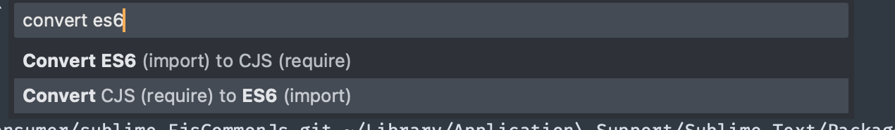

Sublime 4 plugin to convert ES^ `import` to `require` and vice-versa.

convert this:

```js
const { unified } = require('unified')
const remarkParse = require('remark-parse')
const remarkStringify = require('remark-stringify')
const remarkMdx = require('remark-mdx')
```

to this

```js
import { unified } from 'unified'
import remarkParse from 'remark-parse'
import remarkStringify from 'remark-stringify'
import remarkMdx from 'remark-mdx'
```

and vice-versa

## installation

mac:
```
git clone https://github.com/konsumer/sublime-EjsCommonJs.git "${HOME}/Library/Application Support/Sublime Text/Packages/EjsCommonJs"
```

Restart sublime, and you should see new items in menu:



Highlight the `import`s/`require`s and run the command to switch them.
